[](#)
[](#)
[](#)

# Free Prompt Engineering & LLM Systems — No-Cost Playbook

A hands-on path to practice prompt patterns, chaining, evals, and simple tool use **without** paying for the OpenAI platform. Mirrors the structure of popular short courses on prompt engineering and system design, adapted for **local or free resources**.

---

## 📚 Table of Contents

* [What You’ll Build](#what-youll-build)
* [Quick Start (10 minutes)](#quick-start-10-minutes)
* [Environment Setup](#environment-setup)
* [Course-Mirrored Steps (Free Alternatives)](#course-mirrored-steps-free-alternatives)

  * [1) Prompt Fundamentals](#1-prompt-fundamentals)
  * [2) Chaining Calls (Systems)](#2-chaining-calls-systems)
  * [3) Structured Output & JSON “Function Calling”](#3-structured-output--json-function-calling)
  * [4) Retrieval-Augmented Generation (RAG)](#4-retrieval-augmented-generation-rag)
  * [5) Safety & Simple Evaluations](#5-safety--simple-evaluations)
* [Mermaid Workflow](#mermaid-workflow)
* [Exercises & Checkpoints](#exercises--checkpoints)
* [Troubleshooting](#troubleshooting)
* [Attribution](#attribution)

---

## What You’ll Build

* A **local LLM lab** using free tools
* Reusable **prompt templates**
* A **pipeline** that chains steps (Analyze ➜ Plan ➜ Generate)
* A minimal **RAG** demo with a local vector index
* Basic **evals/sanity checks**

---

## Quick Start (10 minutes)

1. **Install Ollama**: [https://ollama.com](https://ollama.com)
2. Pull a small model:

   ```bash
   ollama pull mistral:7b
   ```
3. Chat locally:

   ```bash
   ollama run mistral:7b
   ```
4. Optional GUI: **LM Studio** (point it at an open model and play).

---

## Environment Setup

**Option A: Local + Python**

```bash
python -m venv .venv && source .venv/bin/activate   # Windows: .venv\Scripts\activate
pip install transformers torch datasets faiss-cpu sentence-transformers jupyter
```

**Option B: Google Colab (Free)**
Use `transformers` pipelines directly in a notebook (no GPU required for small models).

**Optional enhancements**

* `langchain` or `llama-index` for chaining
* `datasets` for small eval sets
* `faiss-cpu` for RAG

---

## Course-Mirrored Steps (Free Alternatives)

### 1) Prompt Fundamentals

**Do it free**

* Create `prompts/base.txt` with: **Task**, **Constraints** (tone, audience, style), **Context** (delimited), **Examples** (1–3).
* Run with a local model (Ollama or `transformers`) and iterate until outputs meet spec.

### 2) Chaining Calls (Systems)

**Do it free**

* **Step A (Analyze)** → extract key points
* **Step B (Plan)** → outline as JSON
* **Step C (Write)** → generate final artifact from the plan
* Glue steps with Python functions that call your local model.

### 3) Structured Output & JSON “Function Calling”

**Do it free**

* Force **strict JSON** output; validate with regex/`jsonschema`; retry on failure.
* Simulate “tools” by:

  * Asking the model for a **JSON plan** (tool + args),
  * Executing the tool in Python,
  * Feeding the **tool result** back to the model.

### 4) Retrieval-Augmented Generation (RAG)

**Do it free**

* Build a tiny FAISS index:

  * Split docs → embed with `sentence-transformers` → store in FAISS
  * Retrieve top-k → include in prompt context
* Return **citations** (source filenames/IDs) with answers.

### 5) Safety & Simple Evaluations

**Do it free**

* Maintain a small CSV of prompts + required properties (e.g., “must include a numbered list”; “no PII”).
* Add a Python checker that flags misses and retries with a corrective system message.

---

## Mermaid Workflow

```mermaid
flowchart LR
  %% ===================== LAYERS / STAGES =====================
  subgraph INPUT["User Interaction Layer"]
    A1([User request])
    A2([Uploaded documents or data])
  end

  subgraph PREPROC["Input governance and parsing"]
    B1{{Guardrails - policy / security / PII}}
    B2([Language and format normalization])
  end

  subgraph CONTEXT["Context and knowledge injection"]
    C1[(Vector store - FAISS)]
    C2([Top-k retrieval and ranking])
  end

  subgraph PIPELINE["LLM processing pipeline"]
    D1([Step A - Analysis and entity extraction])
    D2([Step B - Planning - JSON schema strict])
    D3([Step C - Tool invocation and external APIs])
    D4([Step D - Draft generation])
  end

  subgraph EVAL["Validation and quality gates"]
    E1{{Spec compliance and JSON validity}}
    E2{{Safety filters and hallucination checks}}
  end

  subgraph OUTPUT["Delivery and feedback"]
    F1([Formatted output])
    F2([Citations and sources])
    F3([Feedback loop to user])
  end

  %% ===================== FLOWS =====================
  A1 --> B1 --> B2
  A2 --> B2
  B2 -->|valid| C1 --> C2
  C2 --> D1 --> D2 --> D3 --> D4 --> E1
  E1 -->|pass| F1 --> F2 --> F3
  E1 -->|fail| D2
  E2 -. optional audits .-> E1

  %% ===================== STYLES =====================
  classDef process fill:#1e90ff,stroke:#0d3b66,color:#ffffff,stroke-width:2px
  classDef decision fill:#f39c12,stroke:#874000,color:#ffffff,stroke-width:2px
  classDef data fill:#27ae60,stroke:#0b3d2e,color:#ffffff,stroke-width:2px
  classDef output fill:#34495e,stroke:#1f2a35,color:#ffffff,stroke-width:2px

  class A1,A2,B2,D1,D2,D3,D4,F1,F2,F3 process
  class B1,E1,E2 decision
  class C1,C2 data
  class F1,F2,F3 output

```



---

## Exercises & Checkpoints

* **Prompt tuning:** add/remove constraints and compare outputs.
* **Chain growth:** add a *review* step enforcing a style guide.
* **RAG:** index your course notes and cite 2–3 sources per answer.
* **Eval:** write 10 tests; aim for ≥80% pass rate before you “ship”.

---

## Troubleshooting

* **Outputs off-spec:** add explicit formatting constraints and a minimal example.
* **JSON keeps breaking:** prepend a schema, validate, and retry with the validation error.
* **Slow on CPU:** use smaller models (3–7B) and reduce context length.

---

## Attribution

This README mirrors course-style principles using **free/local tools** so you can build skills without API spend.

---

### README.md instructions on how to run this project

Great run! 🥳 Also: your model hallucinated a couple things—we should correct them:

* **No API key needed.** Ollama runs **locally** at `http://localhost:11434`; there’s no `.ollamarc` or key.
* You **don’t need** any special “ollama-api” Python package. Your tiny `requests` wrapper is perfect.

Want a clean, correct README and next steps? Paste this in PowerShell from your project folder to create `README.md`:

````powershell
@'
# Local LLM Lab (Windows) — Ollama + Python 3.11

## Prereqs
- Windows 10/11 (64-bit)
- Python 3.11 (venv recommended)
- [Ollama](https://ollama.com) installed and running (`ollama serve` runs as a service on Windows)
- Pulled model: `ollama pull mistral`

## Setup
```powershell
# from the repo root
py -3.11 -m venv .venv
.\.venv\Scripts\Activate.ps1
python -m pip install -U pip setuptools wheel
pip install requests sentence-transformers faiss-cpu
````

> If `faiss-cpu` gives trouble on Windows, skip RAG for now (it’s only needed for the RAG demo).

## Quick smoke test (Ollama)

```powershell
curl http://localhost:11434/api/tags   # should list "mistral"
ollama run mistral "Say hello in one short sentence."
```

## Run the Analyze → Plan → Generate pipeline

```powershell
python pipeline.py
```

If you see timeouts, open `llm.py` and either (A) use streaming with `stream=True`, or (B) keep non-streaming but set `timeout=600` and `num_predict=256`.

## Minimal RAG demo

1. Put a few `.txt` files in `./data`
2. Build the index:

```powershell
python rag_build_index.py
```

3. Ask grounded questions:

```powershell
python rag_query.py "Summarize install steps in two sentences."
```

## Files

* `llm.py` — tiny HTTP wrapper around Ollama `/api/chat`
* `pipeline.py` — Analyze → Plan → Generate chain
* `rag_build_index.py` — builds FAISS index from `./data/*.txt`
* `rag_query.py` — retrieves context and asks Mistral with citations

## Notes

* Ollama is fully local; **no API key** needed.
* Model name in code is simply `"mistral"`.
* Keep outputs fast with `num_predict=128–256`; raise as needed.
  '@ | Set-Content -Encoding UTF8 .\README.md

```

If you want, I can also drop in the exact **streaming** `llm.py` I recommended so you don’t hit timeouts again. Or we can wire up the RAG files next—your call.
```


