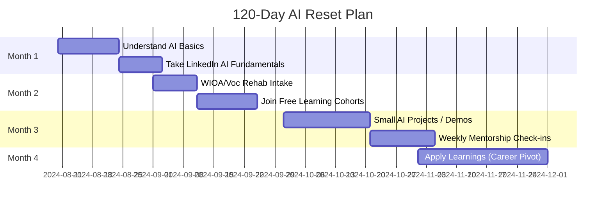

# 🧭 AI Reset Starter Repo

## 🧠 What This Is
A **starter coaching toolkit** for folks who’ve spent years in ERP, support, implementation, or non-coding tech roles — and are now realizing AI is changing the landscape. This is NOT a prompt library. It’s a gentle but clear **pathway to help you learn what actually matters** in the next 30–120 days.

Whether you're laid off, anxious about your role becoming obsolete, or just confused about where to begin — this repo is designed to be your first step.

---

## ✅ What We'll Cover in Our 30–45 Minute Session

### 1. **What’s Really Happening in the Industry**
- Stats and real examples of job displacement (ERP, backend support, homebuilding tech roles)
- Why AI is disrupting *support-first* roles faster than most people think

### 2. **What You DO NOT Need To Learn (yet)**
- You don’t need to master coding right away
- You don’t need to learn everything about LLMs
- You don’t need to jump into deep data science tools

### 3. **What You SHOULD Learn First**
- What a “prompt” is and why it matters
- What generative AI is *actually doing* under the hood
- How to use LinkedIn Learning (free with library card)
- Free beginner AI courses from:
  - Microsoft Learn (Beginner AI track)
  - WIOA / Workforce Development Centers
  - Vocational Rehab (if veteran or disabled)
  - Google AI Essentials

### 4. **Your 30–120 Day Reset Plan**

### 5. **What You’ll Leave With**
- A personal learning roadmap
- Resource list of free training
- 1–2 small project ideas to try
- Understanding of why you’re still valuable — just need a new container

---

## 💬 Suggested Coaching Fee
- Friends & Laid-Off Industry Peers: **$25–$45 per person** *(sliding scale based on situation)*
- Small group option (3–5 people): **$60–$99 flat**

This isn’t a high-ticket sales pitch. It’s a **survival-through-reinvention session**. I’ve been out of work too, so this is priced to respect **your reality and mine**.

---

## 📥 What To Do Next
1. Message me privately if you want to book a session
2. I’ll walk you through this repo, screen-share style
3. You’ll get your own copy + PDF version + accountability check-in

---

## 🙏 Final Note
You’ve kept companies running for years. That matters. This isn’t about starting over — it’s about **starting again, smarter.**

Let’s get you back in the game.
