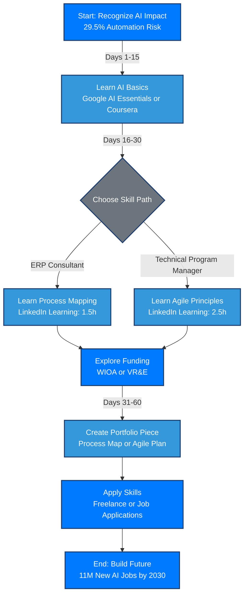

---

# 🔁 AI Reset Coaching Repo: From ERP to AI Confidence

# 🧠 Navigating AI’s Impact on ERP/Support Roles

A coaching guide for mid-career professionals shifting from ERP support, systems implementation, and operations roles into an AI-aware career path.

---

## 📚 Table of Contents

* [Overview](#overview)
* [How AI is Reshaping Support Roles](#how-ai-is-reshaping-support-roles)
* [Free & Low-Cost AI Learning Resources](#free--low-cost-ai-learning-resources)
* [Training Assistance (WIOA & Veteran Benefits)](#training-assistance-wioa--veteran-benefits)
* [LinkedIn Learning Plan (30–60 Days)](#linkedin-learning-plan-30-60-days)
* [Your Role Still Matters](#your-role-still-matters)
* [Step-by-Step Plan](#step-by-step-plan)
* [Mermaid Workflow Diagram](#mermaid-workflow-diagram)
* [Sources](#sources)

---

## 🧭 Overview

If you've worked in ERP support, software implementation, or operations and never needed to learn AI, this guide is your starting point. It's practical, fact-based, and built to get you moving forward without burnout. Use it to:

* Understand how AI is affecting roles like yours
* Access verified upskilling programs and funding
* Follow a step-by-step 60-day learning plan
* Use government or veteran support to fund your training

---

## 🔍 How AI is Reshaping Support Roles

* **29.5%** of U.S. office support hours can be automated by 2030 (McKinsey, 2023)
* **11M+ new jobs** will be created in AI-adjacent fields (WEF, 2025)
* **58%** of in-demand skills are non-technical (CSET, 2024)

Roles in ERP, ticketing systems, and backend coordination are being enhanced or replaced with automation tools. Your experience is still valuable, but you must adapt to hybrid roles — like AI-enhanced ERP Consultant or Technical Program Manager.

---

## 💻 Free & Low-Cost AI Learning Resources

| Tool                      | Duration   | Cost          | Link                                                             |
| ------------------------- | ---------- | ------------- | ---------------------------------------------------------------- |
| Google AI Essentials      | \~10 hrs   | Free (Trial)  | [Google Cloud AI](https://grow.google/ai-essentials)             |
| Coursera: AI for Everyone | \~6 hrs    | Free to Audit | [Coursera AI](https://www.coursera.org/learn/ai-for-everyone)    |
| Microsoft AI Learning Hub | \~5–10 hrs | Free          | [Microsoft Learn](https://learn.microsoft.com/en-us/training/ai) |

---

## 💵 Training Assistance (WIOA & Veteran Benefits)

* **WIOA (Workforce Innovation and Opportunity Act)**

  * Covers \$5K–\$10K in training
  * Apply via [American Job Centers](https://www.careeronestop.org/LocalHelp/AmericanJobCenters/find-american-job-centers.aspx)

* **Veteran Vocational Rehab (VR\&E)**

  * Training + certification support
  * Apply via [VA.gov VR\&E](https://www.va.gov/careers-employment/vocational-rehabilitation/)

---

## 📺 LinkedIn Learning Plan (30–60 Days)

| Course                       | Time    | Focus             |
| ---------------------------- | ------- | ----------------- |
| Learning AI for Business     | 2 hrs   | AI basics for ERP |
| Process Mapping Fundamentals | 1.5 hrs | Workflow skills   |
| Agile PM w/ MS Project       | 2.5 hrs | TPM skillset      |

---

## 🙌 Your Role Still Matters

ERP support, coordination, and stakeholder experience transfer directly into:

* Technical Program Manager (\$90K–\$150K)
* ERP Consultant (\$50–\$150/hr)
* AI Support Lead (Hybrid of tech/process)

You don't need to learn Python or become a data scientist. You need context and tools that work with what you already know.

---

## 🗓 Step-by-Step Plan

| Days  | Focus           | Action                            |
| ----- | --------------- | --------------------------------- |
| 1–15  | Understand AI   | Google AI Essentials, YouTube     |
| 16–30 | Process Mapping | LinkedIn + Contact Job Center     |
| 31–60 | TPM/Consulting  | Agile PM course + Build portfolio |

---

## 🔁 Mermaid Workflow Diagram

---

## 📚 Sources

1. [McKinsey, 2023 – Generative AI Future of Work](https://www.mckinsey.com/mgi/our-research/generative-ai-and-the-future-of-work-in-america)
2. [World Economic Forum, 2025 – Future of Jobs](https://www.weforum.org/publications/the-future-of-jobs-report-2025/)
3. [CSET, 2024 – Workforce Training](https://cset.georgetown.edu/publication/ai-and-the-future-of-workforce-training/)
4. [VA.gov – Vocational Rehab](https://www.va.gov/careers-employment/vocational-rehabilitation/)
5. [LinkedIn Learning](https://www.linkedin.com/learning)
6. [Grow with Google AI Essentials](https://grow.google/ai-essentials)
7. [Microsoft AI Hub](https://learn.microsoft.com/en-us/training/ai)
8. [SAP – AI Upskilling](https://www.sap.com/blogs/upskilling-your-workforce-for-the-ai-era)
9. [Intel – AI Workforce](https://www.intel.com/content/www/us/en/education/higher-education/ai-for-workforce.html)
