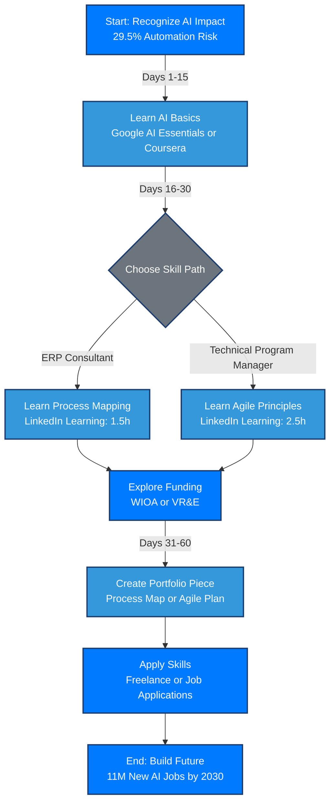

### Response: Navigating AI’s Impact on ERP/Support Roles and Starting Your Upskilling Journey

You’ve built a strong career in ERP support, software implementation, operations, or technical coordination, and you’re now facing the reality of AI reshaping your field. You’re not alone, and your willingness to adapt is a powerful starting point. This response provides a clear, practical guide to understand how AI impacts your job, access free or low-cost learning resources, explore funding options like WIOA and Veteran Vocational Rehab, prioritize LinkedIn Learning or other courses for the next 30–60 days, and gain confidence in building a future in an AI-driven world. I’ll use verified data, avoid jargon, and offer encouragement to keep you motivated.

---

### How AI Is Impacting Jobs Like Yours

AI is automating repetitive tasks in ERP, support, and operations roles, such as system configuration, data entry, and routine troubleshooting, while creating opportunities for hybrid roles that leverage your experience. Here’s a fact-based breakdown:

* **Automation of Routine Tasks**: McKinsey’s 2023 report projects that 29.5% of hours worked in U.S. office support roles could be automated by 2030 due to generative AI. For example, robotic process automation (RPA) tools are increasingly handling ticket resolution and system updates.
* **Demand for Hybrid Roles**: The World Economic Forum projects 11 million new AI-related jobs by 2030, including roles like AI integration specialists and technical program managers — roles that value your background.
* **Value of Non-Technical Skills**: CSET reports 58% of in-demand skills for growing jobs are non-technical: process mapping, communication, judgment. That’s you.

**Bottom Line**: Your job isn’t disappearing. It’s shifting. Companies need professionals to manage AI-enhanced systems, coordinate projects, and bridge the gap between tech and business.

---

### Free or Low-Cost Resources to Learn AI Basics

You don’t need to become a data scientist. You need to know how to work *with* AI. Here are great entry points:

* **Google AI Essentials**: Free (with 7-day trial), self-paced, \~10 hours. Learn practical AI uses for your work. [https://grow.google/ai-essentials](https://grow.google/ai-essentials)
* **Coursera “AI for Everyone” by Andrew Ng**: Free to audit, \~6 hours. Learn what AI is and how it’s used in business. [https://www.coursera.org/learn/ai-for-everyone](https://www.coursera.org/learn/ai-for-everyone)
* **Microsoft Learn “Intro to AI for Business Users”**: Free, flexible modules. Great for ERP professionals using Microsoft tools. [https://learn.microsoft.com/en-us/training/ai](https://learn.microsoft.com/en-us/training/ai)

---

### Funded Training via WIOA or Veteran Vocational Rehab

* **WIOA**: Covers upskilling costs for people displaced by tech. Visit your local American Job Center: [https://www.careeronestop.org/](https://www.careeronestop.org/)
* **Veteran Voc Rehab (VR\&E)**: If you have a VA disability rating, this can cover certifications, training, and equipment. [https://www.va.gov/careers-employment/vocational-rehabilitation/](https://www.va.gov/careers-employment/vocational-rehabilitation/)
* **Community College AI Programs**: Intel-backed AI workforce programs are growing. Many are WIOA-eligible: [https://www.intel.com/content/www/us/en/corporate/artificial-intelligence/ai-for-workforce-us.html](https://www.intel.com/content/www/us/en/corporate/artificial-intelligence/ai-for-workforce-us.html)

---

### 30–60 Day Action Plan

**Days 1–15:**

* Take Google AI Essentials OR Coursera’s AI for Everyone
* Read about how AI impacts ERP (via Microsoft Learn)

**Days 16–30:**

* Finish your first course
* Complete LinkedIn Learning’s "Process Mapping Fundamentals"
* Contact your Job Center for WIOA or apply for VR\&E if eligible

**Days 31–60:**

* Take "Agile Project Management with Microsoft Project"
* Create a mock portfolio piece (e.g. process map or Agile plan)
* Research job titles: ERP Consultant, TPM, Systems Analyst (AI-enhanced)

---

### Mermaid Workflow: Upskilling Plan for ERP/Support Professionals

---

**Need help?** Schedule a 30–45 minute walkthrough with me. I’ll show you how to use this repo, tailor it to your goals, and help you feel confident about what comes next. Pricing is affordable, and sessions are designed for people new to AI.

Let’s do this one step at a time.

